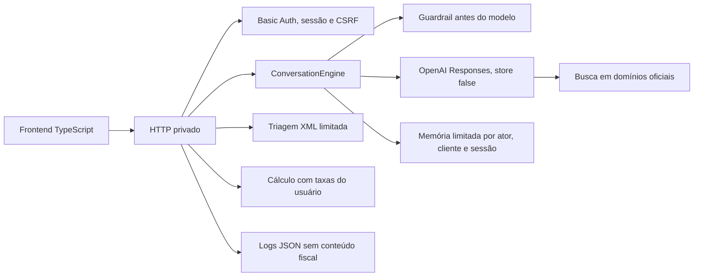

# Clara: copiloto da Reforma Tributária

Piloto privado para uma contadora testar pesquisa fiscal assistida, triagem limitada de XML sintético e simulação matemática de split payment.

Status: candidato a piloto. Não é produto público, validador fiscal ou substituto da revisão profissional.

## Setup

Requisitos: Python 3.12 ou superior e Node.js 22 ou superior.

```bash
python scripts/setup.py
```

O comando é idempotente. Ele cria ou reutiliza `.venv`, instala dependências travadas, executa `pip check` e compila os módulos TypeScript do frontend.

## Executar localmente

macOS e Linux:

```bash
.venv/bin/python backend/server.py
```

Windows:

```powershell
.venv\Scripts\python.exe backend\server.py
```

Abra `http://127.0.0.1:8765`. Sem `OPENAI_API_KEY`, perguntas fiscais materiais terminam em abstenção segura.

## Verificar

macOS e Linux:

```bash
.venv/bin/python scripts/verify.py
```

Windows:

```powershell
.venv\Scripts\python.exe scripts\verify.py
```

Esse é o gate único. Ele executa Ruff, Prettier, TypeScript, validação de JSON, compilação, testes HTTP, evals offline e verificação do LangGraph.

Antes de cada deploy, confirme também que as URLs oficiais continuam acessíveis:

```bash
.venv/bin/python scripts/check_sources.py
```

## Arquitetura



Módulos principais:

- `backend/clara/http_api.py`: autenticação, sessão, CSRF, limites, headers, rotas e logs.
- `backend/clara/conversation.py`: contexto, orquestração, abstenção, revisão e hard gates.
- `backend/clara/openai_client.py`: integração server-side com Responses API e busca oficial.
- `backend/clara/documents.py`: triagem XML sem status de aprovação e cálculo didático.
- `backend/clara/knowledge.py`: catálogo oficial versionado e expiração por revisão.
- `frontend/runtime.ts` e `frontend/app.ts`: contratos, API e interface tipada.
- `frontend/styles.css`, `chat.css`, `tools.css` e `governance.css`: estilos separados por responsabilidade.
- `frontend/app.js`: artefato compilado servido pelo backend.

## Contratos de segurança

- Chave OpenAI somente em `OPENAI_API_KEY` no servidor.
- Nenhuma rota de configuração de chave existe no navegador.
- Em piloto, HTML, assets e APIs exigem Basic Auth. Somente health e readiness são públicos.
- Requisições mutáveis exigem sessão, CSRF, Origin, Host e `application/json`.
- Corpo, mensagem, XML, sessões, taxa e concorrência possuem limites.
- Prompt injection e evasão são bloqueados antes da chamada ao modelo e não entram no histórico.
- Resposta fiscal material exige busca oficial ao vivo. Falha de rede, conflito ou ausência de fonte gera abstenção.
- Toda conclusão fiscal material é rascunho para revisão obrigatória da contadora.
- XML do piloto precisa ser sintético e nunca recebe status de válido, aprovado ou autorizado.

## Privacidade e limitações

Leia `PRIVACY_NOTICE.md` antes do teste. O piloto proíbe dados reais, senhas, certificados e identificadores de clientes.

Com OpenAI ativa, perguntas e até oito turnos recentes são processados com `store: false`. A política padrão do provedor pode manter logs de monitoramento de abuso por até 30 dias. O XML bruto não é enviado ao modelo nem gravado pela aplicação.

A memória é local, limitada e expira após duas horas de inatividade. Reinício ou deploy apaga as sessões. O piloto usa exatamente uma réplica.

## Deploy

O contrato Railway está em `railway.json`. Segredos não ficam no repositório. Siga `PILOT_RUNBOOK.md` para variáveis, smoke, monitoramento e rollback.

Nenhum deploy é automático. Publicação e alterações externas exigem confirmação explícita.

## Evals

`evals/run_evals.py` valida abstenção, claims proibidas e bloqueios críticos. `evals/run_conversation_evals.py` valida continuidade, isolamento, não persistência de injection e o contrato de XML.

Os baselines antigos são históricos da demo inicial. Uma nova baseline só pode ser promovida após revisão da contadora sobre os casos fiscais versionados.
